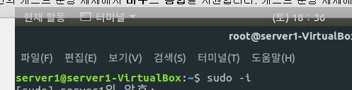

# 도커 다운로드 및 이미지 찾기도커 레지스토리

생성일: 2021년 12월 11일 오후 6:32

## 도커 다운로드

관리자로 변경하는 명령어

- sudo -i



관리자로 변경한 이후에 apt -install docker.io를 진행합니다.

tomcat 다운로드 및 실행

```
docker run -d -p 8080:8080 --name tc consol/tomcat-7.0
```

## 이미지 찾기 도커 레지스트리

도커 레지스트리는 사용자가 사용할 수 있도록 데이터베이스를 통해 Image를 제공해 주고 있다.

누구나 이미지를 만들어 푸시할 수 있으며 푸시된 이미지는 다른 사람들에게 공유가능하다.

도커 퍼블릭 레지스트리 검색 및 확인

→ [https://hub.docker.com/](https://hub.docker.com/)

이름의 경로가 있는경우 → 일반 사용자가 업로드

경로 없이 이름만 있는경우  →official image

도커 명령어 검색

sudo docker search tomcat

이미지만 다운로드 받기

docker pull mysql

※ run / pull의 차이점

run : 단순히 image안의 파일을 실행할 목적을 가지고 있다. 메인으로 실행되는 파일이 종료되면 컨테이너도 같이 종료된다 따라서 계속해서 컨테이너를 유지하고 싶다면 -d 옵션을 이용한다.

다운받은 image를 실행하는 

pull : docker hub로 부터 image를 다운받는 명령어 (image 다운로드)