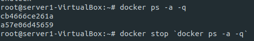

# 도커의 유용한 명령어 / 연습문제

생성일: 2021년 12월 11일 오후 6:32

### 도커의 유용한 명령어

- 포트포워딩으로 톰켓 실행하기

```bash
docker run -d --name tc consol/tomcat-7.0
```


- 캐시 지우기

```bash
curl 127.0.0.1
```


- 컨테이너 내부 셸 실행

```bash
docker exec -it tc /bin/bash
## -i : input / -t : terminal
## 로그및 디버깅 작업이 가능합니다.
```

- 컨테이너 로그 확인

```bash
docker logs tc
```

- 호스트 및 컨테이너 간 파일 복사 / 파일 이동, 다른 컨테이너로 복사

```bash
docker cp <path> <to container>:<path>
docker cp <from container>:<path> <path>
docker cp <from container>:<path> <to container>:<path>
```

 


- 컨테이너의 아이디만 조회후 모두 종료

```bash
docker ps -a -q
docker stop `docker ps -a -q`
```



- 임시 컨테이너 생성

```bash
docker run -d --name tc -p 80:8080 --rm consol/tomcat-7.0
```


### 도커 컨테이너 실행 연습문제

다음 이미지를 사용 : jenkins/jenkins:lts-jdk11

1. 기존에 설치된 모든 컨테이너와 이미지 정지 및 삭제
2. 도커 기능을 사용해 Jenkins 검색
3. Jenkins를 사용하여 설치
4. Jenkins 포트로 접속하여 웹 서비스 열기
5. Jenkins의 초기 패스워드 찾아서 로그인하기